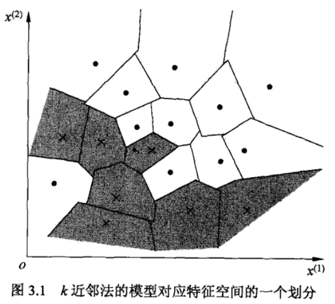
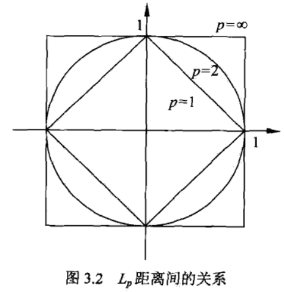

## 第3章-$k$近邻法-$k$近邻算法
### $k$近邻算法
**算法3.1：**  
输入：训练数据集$T=[(x_1,y_1),\dots,(x_N,y_N)),x_i \in X \subseteq R^n,y_i \in Y = \{c_1,\dots,c_K\}$，实例特征向量$x$  
1. 根据给定的距离度量（欧式距离），在训练集中找到与$x$最近的$k$个点，涵盖这个$k$个点的领域记作$N_k(x)$
2. 在$N_k(x)$中根据分类决策规则（如多数表决）决定$x$的类别$y$  

输出：实例$x$所属的类别$y$

**说明：**

 
图3.1  KNN算法

&emsp;&emsp;对于任何一个统计学习方法来说，都需要有一个训练数据集，图中所有蓝色正方形和红色三角形代表训练集的数据，绿色的圆形表示要预测的数据，在图中，输入变量是一个二维向量（点的坐标），颜色对应了输出变量，训练集中有11个实例，判断绿色圆形属于哪一类（红色或蓝色）。如果k=3（实线圆圈）它被分配给第二类，因为有2个三角形和只有1个正方形在内侧圆圈之内。如果k=5（虚线圆圈）它被分配到第一类（3个正方形与2个三角形在外侧圆圈之内）。
### $k$近邻模型
#### 模型  
k近邻方法没有显式的模型形式

 
图3.2  KNN模型

  

&emsp;&emsp;上图是一个二分类问题，对应的类别是$\bullet$和$\times$，在这个例子中，$k$取值为1，对于每一个要做判断的实例，寻找与其相邻最近的一个点，然后判定为该点的类别。对于每一个训练集的点，都有一个小的多边形区域，在该区域内的点，都属于同一个类别。  
&emsp;&emsp;$k=1$的时候，该模型称为最近邻模型，该模型相当于在空间中做了一个划分，该划分没有显式的形式，如果要将这个划分写出来，对应的每一个训练集实例都需要很多个超平面方程来定义。对于这种没有显式形式的模型，在做分类的时候，每当得到一个新的实例$x$，都需要在原始的训练集数据中做搜索。

#### 距离度量  

 
图3.3  Lp距离间的关系

  

&emsp;&emsp;用$p$范数$\|x-x_i\|_p$来度量，$L_p$距离定义如下：$$L_p(x_i,x_j)=\left(\sum^n_{l=1} |x^{(l)}_i-x^{(l)}_j|^p \right)^{\frac{1}{p}}$$
通常$p$的取值为$1，2，\infty$。  
&emsp;&emsp;上图中，取原点为基准点，和该点距离相等的点，当取$p=1$时，在正方形边上的点和原点的距离相等，这就是1-范数；当$p=2$时，在圆形边上的点和原点距离相等，这就是2-范数；当$p=\infty$时，在最外面正方形边上的点到原点的距离相等，这就是$\infty$-范数。最熟悉的是2-范数，即欧式距离。  
&emsp;&emsp;那么其他两种意义是什么呢？当$p=1$时，就是对应点的坐标差值的绝对值之和。当$p=\infty$时，绝对值最大的那个元素，该元素的绝对值就是$\infty$-范数。  

#### $k$值的选择
&emsp;&emsp;在最开始的例子中，已经描述过了（见图3.1），当$k=3$时（实线圆圈），判定绿色点为红色类，当$k=5$时（虚线圆圈），判定绿色点为蓝色类。那么$k$值应该如何选取呢？一般采用交叉验证的方法，将训练数据集分成两类（训练集和验证集），用验证集的实例，给出该实例的特征向量，然后在训练集上选取不同的$k$值，用k近邻模型，验证实例对应的类别，从而选出最合适的$k$值。

#### 分类决策规则
&emsp;&emsp;对于分类问题，一般采用多数表决，在最近的K个邻近点中，属于哪一类的点最多，就将预测点判定为该类。对应的经验风险为$\displaystyle \frac{1}{k} \sum_{x_{i} \in N_{k}(x)} I(y_{i} \neq c_{j})$。  
&emsp;&emsp;上述公式含义：见图3.1，取$k=3$（实线圆圈），用唯一的类别给该区域内的点打标签，假如标签为红色，考察训练集上的损失值，易得$\frac{1}{3}\left(I(y_1 \neq 红) + I(y_2 \neq 红) + I(y_3 \neq 红)\right)=\frac{1}{3}$，以上所得为区域中的点判定为红色的损失。当判定为蓝色时，损失为$\frac{1}{3}(I_1+I_2+I_3)=\frac{2}{3}$，取损失值最小的类别，得到红色类别，故将该区域所有的点都判定为红色。

### $k$近邻法的实现：$kd$树
&emsp;&emsp;本节介绍了一个$kd$树存储数据的方法，对于每一个要预测的实例，都需要寻找和其特征向量距离最近的那些训练集中的实例，当特征向量维度很高时，这种搜索很耗时，这就需要一种特殊的数据结构，不需要遍历训练集中的每一个实例。  

### 回顾总结
&emsp;&emsp;第2章和第3章介绍的都是分类问题的方法，这两种方法都可以用于解决二分类问题，针对输入变量是连续变量。下面对比两种方法的不同：  
1. 第2章的感知机模型，需要使用所有的训练集数据，找到一个可以分割两类的超平面，并要求数据是线性可分的，当然对于数据不是线性可分时，也有相应的感知机算法。当找到这个超平面，训练数据集就可以不再需要了，仅根据该超平面，就可以判定新实例的类别。总的来说，感知机模型用全部数据找到了一个全局的结构，保留这个结构并遗弃训练集数据，用该结构预测新实例。
2. 第3章的$k$近邻算法，并没有用全部数据寻找一个结构，所用的是一个局部的信息，所找的是要预测的这个实例离该点最近的那些点，然后使用这些实例进行预测。当使用局部信息时，需要存储全部的训练数据集。

&emsp;&emsp;要如何在这两种算法中选择呢？当数据具有线性可分结构时，用感知机模型更好，因为计算简单，但当数据不是线性可分时，只能使用预测点周围的信息（局部信息）进行分类判定，此时$k$近邻算法更好，该算法对整个数据集的结构（即模型的结构）没有那么强的假设。