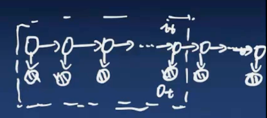
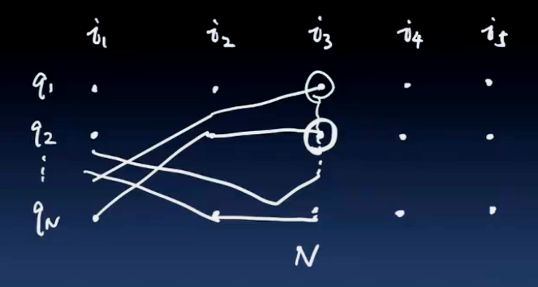

## 第10章-隐马尔科夫模型-维特比算法
&emsp;&emsp;维特比算法是求解给定的观测条件下，使得概率最大的状态变量的序列预测，也就是说，求解已知观测序列$i_1,i_2,\cdots,i_T$的出现的概率最大：$\max P(i_1,i_2, \cdots,i_T|o_1,o_2,\cdots,o_T,\lambda) $等价于$\max P(i_1,i_2, \cdots,i_T, o_1,o_2,\cdots,o_T)$  
$\displaystyle \because P(i_1,i_2, \cdots,i_T|o_1,o_2,\cdots,o_T,\lambda) = \frac{P(i_1,i_2, \cdots,i_T, o_1,o_2,\cdots,o_T)}{P(o_1,o_2,\cdots,o_T)}$  
&emsp;&emsp;因为$P(o_1,o_2,\cdots,o_T)$已知，所以相当于求解$\max P(i_1,i_2, \cdots,i_T, o_1,o_2,\cdots,o_T)$  
&emsp;&emsp;书中借助了一个新定义的函数，然后用这个函数的递推关系，推导出了维特比算法，这个函数是$$\delta_t(i)=\max P(i_1,i_2,\cdots,i_{t-1},i_t=i,o_t,\cdots,o_1)$$
 
 
图10-1 HMM模型

  

&emsp;&emsp;函数所表达的就是图10-1中虚线框的部分，当固定$i_t$状态的取值，寻找前面的最优路径$(i_1,i_2,\cdots,i_{t-1})$使得$\delta_t(i)$最大。
 
 
图10-2 维特比算法最优路径

  

&emsp;&emsp;如图10-2所示，假如$i_t$取值为3，也就是说固定$i_3$取值（图中的点坐标为$(q_2,i_3)$），路径为图中所示通过坐标点$(q_2,i_3)$的折线，变换$i_3$固定的值（坐标点$(q_1,i_3)$），找寻前面的路径，使得出现的概率最大，对于每一个不同的取值$q_1,\cdots,q_N$，都有不同的路径，一共有N条路径。  
&emsp;&emsp;接下来考察$\delta_{t+1}(i)$，在$t+1$的时刻，状态取值为$i$的最大概率：$$\delta_{t+1}(i) = \mathop{\max} \limits_{i_1,\cdots,i_t} P(i_1,\cdots,i_t,i_{t+1}=i,o_{t+1},\cdots,o_1) $$  

> Bellman最优性原理：  
&emsp;&emsp;假设$i_{t+1}$的最优路径中，与$i_t$相连的路径假如已经确定，那么$i_t$之前的路径也已经确定了，并且不会改变，也就说，在求解$i_{t+1}$的最优路径时，只需要求解$i_{t+1}$与$i_t$之前的最优路径，而不需要再求解$i_t$之前的最优路径了。

根据Bellman最优性原理:$$\begin{aligned} \delta_{t+1}(i)
&= \mathop{\max} \limits_{i_1,\cdots,i_t} P(i_1,\cdots,i_t,i_{t+1}=i,o_{t+1},\cdots,o_1) \\
&= \mathop{\max} \limits_{j} \delta_t(j) P(i_{t+1}|i_t=j)P(o_{t+1}|i_{t+1}=i)
\end{aligned}$$其中$\delta_t(j)=\max P(i_1,i_2,\cdots,i_{t-1},i_t=j,o_t,\cdots,o_1)$  
$\because a_{ji}=P(i_{t+1}|i_t=j), b_i(o_{t+1})=P(o_{t+1}|i_{t+1}=i)$  
$\displaystyle \therefore \delta_{t+1}(i) = \mathop{\max} \limits_{j} \left[\delta_t(j) a_{ji} \right]b_i(o_{t+1})$  
&emsp;&emsp;在递推的过程中，上述刚刚介绍了如图10-2中，从$i_1$到$i_2$有一个最优路径，对$i_3$的每一个状态也有一个最优路径，对$i_4$的每一个状态也有一个最优路径，每考虑一个状态时，最后都得到了$N$个最优路径，对应$i_t$下状态的$N$个取值前面的路径。  
&emsp;&emsp;当计算$i_3$的$N$个最优路径，为什么要将这些路径都保存起来呢？为什么不能直接寻找概率最大的路径？其实是不能的，如果只保留了$i_3$状态下概率最大的那个路径，当前的最大路径并不能保证，当考虑下一个时刻的最优路径，该路径是否经过前面状态的概率值最大的路径，因为后面这一步还会带来概率的变化，所以对于$i_t$的每一个状态，都需要记录之前的最优路径，一直记录到$i_T$，于是就有了$N$条最优路径，当计算到$i_T$时，就可以找到最终概率最大的值对应的最后一个状态，然后再反推前面的路径。 

> **算法10.5（维特比算法）**  
输入：模型$\lambda=(A,B,\pi)$和观测$O=(o_1,o_2,\cdots,o_T)$  
输出：最优路径$I^*=(i_1^*,i_2^*,\cdots,i_T^*)$  
(1)初始化$$\delta_1(i) = \pi_i b_i(o_1),\quad i=1,2,\cdots,N \\
\psi_1(i)=0,\quad i=1,2,\cdots,N$$(2)递推，对$t=2, 3,\cdots,T$
$$\delta_t(i)=\mathop{\max} \limits_{1 \leqslant j \leqslant N}\left[\delta_{t-1}(j)a_{ji} \right] b_i(o_t),\quad i=1,2,\cdots,N \\ 
\psi_t(i) = \mathop{\arg \max} \limits_{1 \leqslant j \leqslant N} \left[\delta_{t-1}(j)a_{ji} \right], \quad i=1,2,\cdots,N$$(3)终止$$P^*=\mathop{\max} \limits_{1 \leqslant i \leqslant N} \delta_T(i) \\
i_T^*=\mathop{\max} \limits_{1 \leqslant i \leqslant N} \left[\delta_T(i) \right]$$(4)最优路径回溯，对$t=T-1,T-2,\cdots,1$ $$i_t^*=\psi_{t+1}(i_{t+1}^*)$$求得最优路径$I^*=(i_1^*,i_2^*,\cdots,i_T^*)$.
